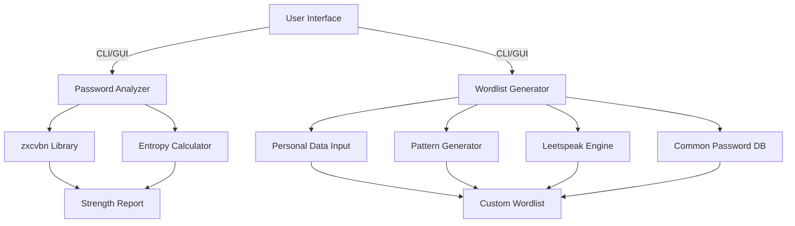

# 🔐 Password Toolkit Pro: Enterprise-Grade Password Analysis & Wordlist Generation


---

## 📑 Overview

**Password Toolkit Pro** is a professional-grade security suite designed for security analysts, penetration testers, and IT administrators. It combines advanced password strength analysis with intelligent, customizable wordlist generation — providing both proactive security auditing and realistic password attack simulation capabilities.

### ✨ Key Highlights:

* **Robust password strength assessment** using Dropbox’s zxcvbn algorithm and entropy-based calculations.
* **Context-aware, targeted wordlist generation** based on personal information and pattern mutations.
* **Dual-interface operation:** Command-Line (CLI) for automation and a modern GUI for interactive analysis.
* Incorporates **leetspeak transformation, keyboard walks, and contextual patterns**.
* **Export-friendly outputs** for seamless integration into offensive and defensive security workflows.

---

## 🚀 Features

### 🔍 Password Analysis Engine

* Real-time strength evaluation via **zxcvbn**.
* **Shannon entropy calculation** for mathematical password strength metrics.
* Crack time estimation based on modern attack scenarios and hardware benchmarks.
* Actionable security recommendations for weak passwords.

### 📝 Wordlist Generator

* Generates **targeted, personal-data-based wordlists**.
* Supports **leetspeak substitution** with adjustable transformation depth.
* Includes contextual mutations like years, sequences, and common suffixes.
* Generates keyboard walks, capitalization variants, and name combinations.
* Outputs clean, length-constrained wordlists (configurable between 4–64 characters).

### 💻 Professional Interfaces

* **CLI Mode** for headless automation and security scripting.
* **Modern GUI** featuring:

  * Dark theme & responsive layout.
  * Tabbed multi-tool interface.
  * Real-time progress monitoring.
  * Comprehensive error handling.

---

## 📦 Installation

### 🔧 Prerequisites

* Python `3.7+`
* `pip` package manager

### 📥 Setup Instructions

```bash
git clone https://github.com/yourusername/password-toolkit-pro.git
cd password-toolkit-pro
pip install -r requirements.txt
```

---

## 🛠️ Usage

### 📊 Password Analysis (CLI)

```bash
python password_tool.py analyze "YourPassword123!" [--entropy]
```

**Example Output:**

```
Password: YourPassword123!
Strength Score: 3/4
Estimated Crack Time: 3 hours
Entropy: 65.32 bits (Strong)
```

---

### 📄 Wordlist Generation (CLI)

```bash
python password_tool.py generate \
  --output wordlist.txt \
  --first John \
  --last Doe \
  --birth 1990 \
  --pet Fluffy \
  --max-leet 2
```

---

### 🖥️ Graphical User Interface (GUI)

```bash
python password_tool.py
```

---

## 🖥️ GUI Walkthrough

### 🔐 Password Analysis Tab


* Enter password for analysis.
* Select strength analysis parameters.
* View comprehensive security report.
* Receive improvement recommendations.

---

### 📜 Wordlist Generator Tab


* Input personal information.
* Configure leetspeak level (0–3), inclusion of common passwords, and keyboard walks.
* Select output destination.
* Generate intelligent, targeted wordlists.

---

## 🧩 Technical Architecture



---

## 📚 Use Cases

| Scenario                          | Description                                                                                |
| :-------------------------------- | :----------------------------------------------------------------------------------------- |
| 🔍 **Security Auditing**          | Assess organizational password policies and identify weak credentials.                     |
| 🎯 **Penetration Testing**        | Generate and use custom wordlists for targeted password attacks in red teaming operations. |
| 🧑‍🏫 **User Awareness Training** | Visually demonstrate password vulnerabilities and improvement tips.                        |
| 📊 **Security Research**          | Analyze password strength trends, common password patterns, and crack times.               |

---

## ⚙️ Advanced Configuration

Edit `config.json` to customize analysis thresholds and wordlist behaviors:

```json
{
  "entropy_thresholds": {
    "very_weak": 28,
    "weak": 36,
    "moderate": 60,
    "strong": 128
  },
  "wordlist": {
    "min_length": 4,
    "max_length": 64,
    "year_range": 10,
    "common_suffixes": ["!", "@", "#", "$", "%", "123", "1234"],
    "keyboard_walks": ["qwerty", "asdfgh", "zxcvbn", "123456"]
  }
}
```

---

## 🤝 Contributing

Contributions are highly welcome!
To get started:

1. Fork this repository.
2. Create a new feature branch.
3. Commit your changes with clear messages.
4. Open a pull request detailing your additions.

---


## 🙏 Acknowledgements

* [**zxcvbn**](https://github.com/dropbox/zxcvbn) by Dropbox for its brilliant password strength estimator.
* [**NLTK**](https://www.nltk.org/) for natural language processing support.
* The wider cybersecurity research community for password pattern and wordlist data.

---

## 📣 About

**Password Toolkit Pro** is your all-in-one professional-grade password security toolkit — enabling comprehensive password auditing, targeted wordlist creation, and user awareness training. Elevate your security operations today.

---


